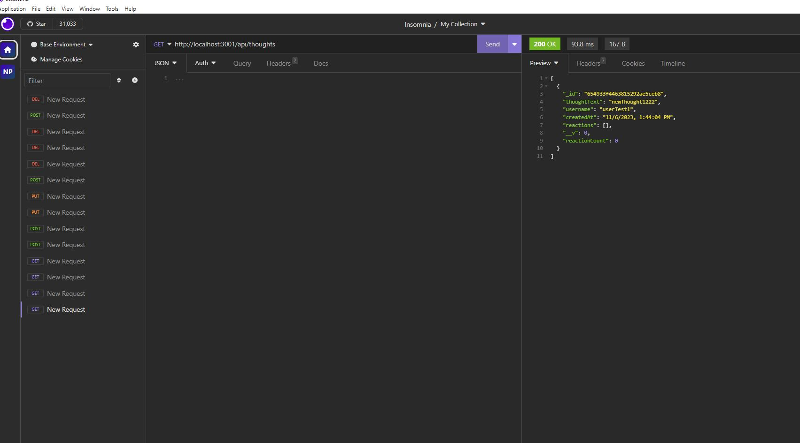

# Employee Tracker

## Description
My motivation behind creating the social media network was to make relatively flexible backend with help of mongodb and mongoose. In this app-user can create users, thoughts and reactions to the thoughts. App user can delete, update add friends and remove them as well. 

  ## Github Repo link: 
  https://github.com/Nehaps29/socialnetworkwithmongoose

  ## Short Video Link: 

  https://drive.google.com/file/d/1DwHz0erP-F2Z452cG3gCQnnDQXdq3XxK/view

  ## Picture of Users and Thoughts Structure
  
  
  

  ## Table of Content

  - [Installation](#installation)
  - [Usage](#usage)
  - [Contribution Details](#contribution-details)
  - [Test Instructions](#test-instructions) 
  - [License](#licenses)
  - [Contact](#contact)
  
  

  ## Installation: 
    Express, MongoDB, mongoose and Insomnia

  ## Usage:
  to make social netwrok backend scalable and flexible

  ## Contribution Details: 
    
    Neha Sabannavar, Rutgers TA, Xpert Learning Assistant, AskBCS, Mongoose documentation: https://mongoosejs.com/docs

  ## Test Instructions: 
   Command to run the script : 
   - npm install mongoose
   - npm i
   - node index

  ## Licenses: 
  MIT
      
  https://opensource.org/licenses/MIT 

  
  ## Contact: 
  Below mentioned is my github profile link 

  ## Github: https://github.com/nehaps29
  

  